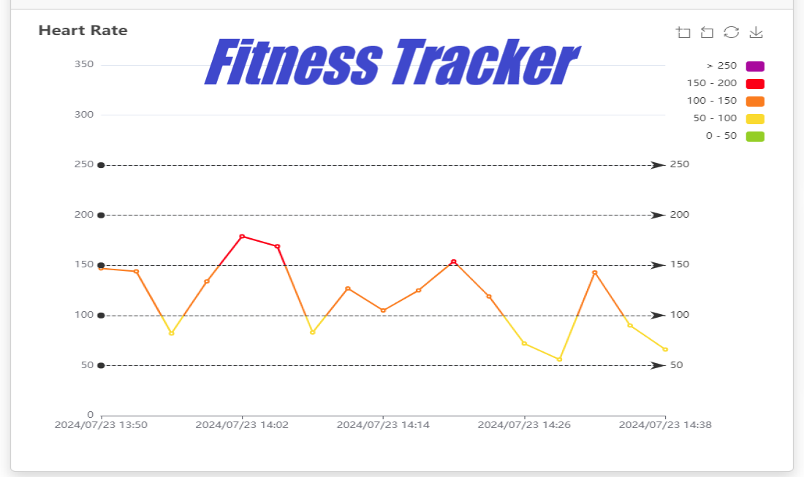
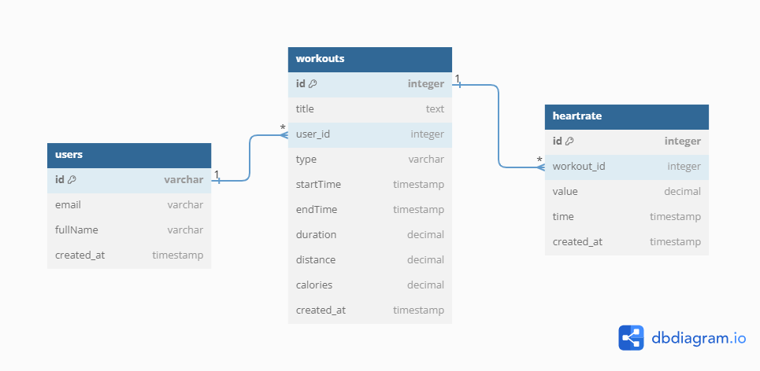
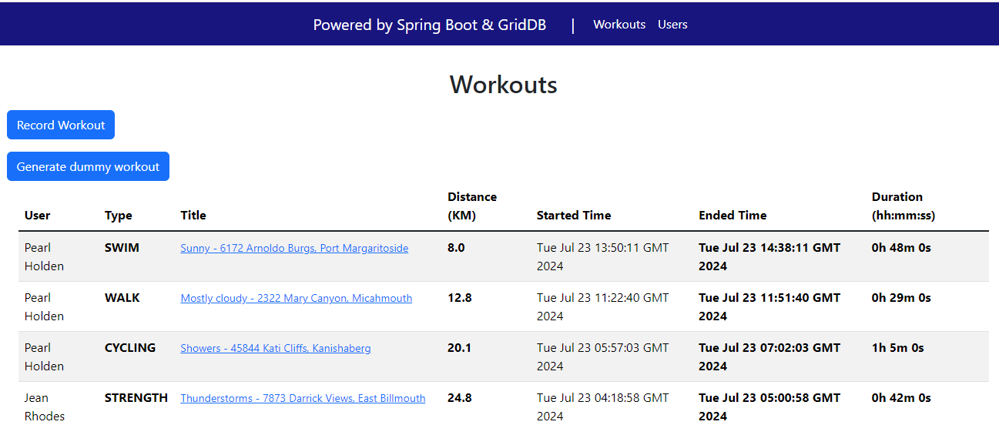
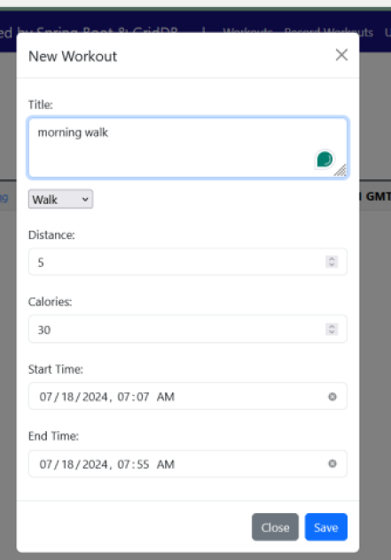
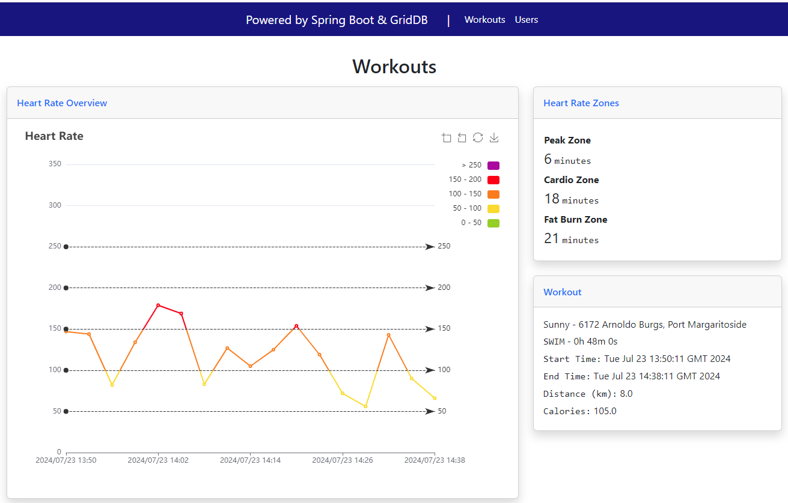

Building a Fitness Tracker Web using Spring Boot
===


Being healthy and fit should be part of our lifestyle. Living a healthy lifestyle can help prevent long-term illnesses. One way to achieve that is by keeping records of our workouts, including the exercise type, duration, and heart rates.

In this technical article, we'll explore the process of creating a simple Fitness Tracking web using Spring Boot. We'll start by creating a web app that can record our workouts - the when, what, and how long. We're also going to tap into heart rate data and turn that data into a sleek line chart that shows our heart rate over time. It's like giving your workout a visual heartbeat! We'll break everything down into bite-sized pieces, explaining each step along the way.

## Features and Functionalities

Here are some features that this web application will support:

* User can record their workout information like distance, calories, and start and end time.
* User can view the heart rate data in a line chart
* User can view the analysis of their heart rate zone

In this article, we don't provide:
* RESTful endpoints to be consumed by mobile applications.
* User registration. For demo purposes, we will provide demo users.
* Integration with popular fitness APIs (Fitbit, Google Fit)
* Specific metrics for each workout type

## The Data Model

The complete data model.



We'll have a table `users` to store the details of people who use the application. For now, we don't have user registration, so the user's tables contain only name and email.

Next, we're talking about the fitness data storage. The main table is `workouts` which captures details of the workouts users perform.

* `id` - Assigns a unique ID to each workout.
* `startTime` and `endTime` - Hold the value of time when the workout starts and finished.
* `distance` - Sports like running or cycling are measured in terms of distance covered.
* `calories` - Hold the value of calories burnt by the user while doing a workout. We don't use any formula to calculate the calories burnt, the user can input any value.
* `duration` - Auto populates by the system.

To record the heart rate we create one table named `heartrate`. The columns in this table are:

* `id` - Assigns a unique ID to each heart rate data.
* `workout_id` - Identify which workout this data belongs to.
* `value` - Stores the heart rate value.
* `time` - Store the date and time when the heart rate value changed.

To make the demo easier, we won't have an option to enter heart rate values manually. Instead, we'll create a function that automatically generates a random heart rate value every 3 minutes during the workout.

## Technology Stack

* Spring Boot: Open-source Java framework used for programming standalone, production-grade Spring-based applications with minimal effort. Spring Boot is a convention-over-configuration extension for the Spring Java platform intended to help minimize configuration concerns while creating Spring-based applications

* GridDB: Next-generation open-source database that makes time series IoT and big data fast, and easy.

* Thymeleaf: Java XML/XHTML/HTML5 template engine that can work both in web and non-web environments. It is better suited for serving XHTML/HTML5 at the view layer of MVC-based web applications, but it can process any XML file even in offline environments. It provides full Spring Framework integration.

* [Apache EChart](https://echarts.apache.org/en/index.html): A declarative framework for rapid construction of Web-based visualization. Apache ECharts provides more than 20 chart types available out of the box, along with a dozen components, and each of them can be arbitrarily combined to use.

* Maven: Build automation tool used primarily for Java projects.

* Docker: is an open source platform that enables developers to build, deploy, run, update and manage containerized applications

## Setting Up the Development Environment

First, we need to install [Java 17 or later](https://jdk.java.net/21/), [Maven 3.5+](https://maven.apache.org/download.cgi), [Docker engine](https://docs.docker.com/engine/install/), and text editor ([Intellij IDEA](https://spring.io/guides/gs/intellij-idea/), or [VSCode](https://spring.io/guides/gs/guides-with-vscode/)).

To start from scratch, visit [Spring Initializr](https://start.spring.io/) and add dependencies Spring Web, Thymeleaf, Lombok, and Spring Boot DevTools. After that, click on the generate button and download the zip file. Unzip the file and open the project in your favorite IDE.

Next, we should add the required dependencies. For interacting with GridDB, we need to add a GridDB Java Client dependency like this:

```xml
<dependency>
  <groupId>com.github.griddb</groupId>
  <artifactId>gridstore</artifactId>
  <version>5.5.0</version>
</dependency>
```
<p>

The complete `pom.xml` file can be found [here](https://github.com/alifruliarso/springboot-fitness-tracking/blob/235ff7d514def6a11806ac880f528990d7bcda04/pom.xml).

## Key Feature Implementation

In this project, we will use the Controller-Service-Repository (CSR) pattern. This pattern promotes the separation of concern by dividing the application logic into three distinct layers: the Controller, the Service, and the Repository. Each layer has a specific responsibility, making the code easier to manage.

After completing the Maven dependencies, we need to create several folders as follows:

```
src/main/java/com/galapea/techblog/fitnesstracking/
├── config
├── controller
├── entity
├── model
└── service
```

To be able to store the fitness information in GridDB database, we need to define the entity classes inside the entity folder.

* Create a new domain object to present a User as the following example:
```
@Data
public class User {

	@RowKey
	String id;
	String email;
	String fullName;
	Date createdAt;

}
```

* Workout
```
@Builder
@NoArgsConstructor
@AllArgsConstructor
public class Workout {

	@RowKey
	public String id;
	public String title;
	public String type;
	public String userId;
	public Date startTime;
	public Date endTime;
	public Double distance;
	public Double duration;
	public Double calories;
	public Date createdAt;

}
```

* HeartRate
```
@Data
public class HeartRate {

	@RowKey
	String id;
	Date timestamp;
	double value;
	String workoutId;

}
```

After that, we need to configure the database connection. Since we don't have the Spring Boot auto-configuration for GridDB, so we will configure them by creating a `GridDBConfig`. We used the entity classes created earlier in this config to represent the container (table) in the database.
```java
@Configuration
public class GridDBConfig {

	@Value("${GRIDDB_NOTIFICATION_MEMBER}")
	private String notificationMember;

	@Value("${GRIDDB_CLUSTER_NAME}")
	private String clusterName;

	@Value("${GRIDDB_USER}")
	private String user;

	@Value("${GRIDDB_PASSWORD}")
	private String password;

	@Bean
	public GridStore gridStore() throws GSException {
		Properties properties = new Properties();
		properties.setProperty("notificationMember", notificationMember);
		properties.setProperty("clusterName", clusterName);
		properties.setProperty("user", user);
		properties.setProperty("password", password);
		GridStore store = GridStoreFactory.getInstance().getGridStore(properties);
		return store;
	}

	@Bean
	public Collection<String, User> userCollection(GridStore gridStore) throws GSException {
		Collection<String, User> collection = gridStore.putCollection(AppConstant.USERS_CONTAINER, User.class);
		collection.createIndex("email");
		return collection;
	}

	@Bean
	public Collection<String, HeartRate> heartRateCollection(GridStore gridStore) throws GSException {
		Collection<String, HeartRate> heartRateCollection = gridStore.putCollection(AppConstant.HEARTRATE_CONTAINER,
				HeartRate.class);
		heartRateCollection.createIndex("workoutId");
		return heartRateCollection;
	}

	@Bean
	public Collection<String, Workout> workoutCollection(GridStore gridStore) throws GSException {
		Collection<String, Workout> workoutCollection = gridStore.putCollection(AppConstant.WORKOUT_CONTAINER,
				Workout.class);
		workoutCollection.createIndex("userId");
		workoutCollection.createIndex("title");
		workoutCollection.createIndex("type");
		return workoutCollection;
	}

}
```
To access GridDB, we need to get a GridStore instance using the GridStoreFactory. Connecting to GridDB cluster using the fixed list method, we need to specify the following required properties:

1. `notificationMember`	A list of address and port pairs in cluster. It is used to connect to cluster which is configured with FIXED_LIST mode, and specified as follows. (Address1):(Port1),(Address2):(Port2),... This property cannot be specified with neither notificationAddress nor notificationProvider properties at the same time. This property is supported on version 2.9 or later.
2. `clusterName`	A cluster name. It is used to verify whether it matches the cluster name assigned to the destination cluster. If it is omitted or an empty string is specified, cluster name verification is not performed.

<p>

### Listing workout



We create an HTML template `workouts.html` to display the list of workouts using the `th:each` dialect:
```
                    <tbody class="table-group-divider">
                        <tr th:each="workout : ${workouts}">
                            <td id="user" scope="row" th:text="${workout.user} ? ${workout.user.fullName} : ''"></td>
                            <th id="type" scope="row">[[${workout.type}]]</th>
                            <td>
                                <a class="small" th:href="@{/heartrate/{id}(id=${workout.id})}"
                                    th:text="${workout.title}"></a>
                            </td>
                            <th id="distance" scope="row">[[${workout.distance}]]</th>
                            <td id="startTime" scope="row">[[${workout.startTime}]]</td>
                            <th id="endTime" scope="row">[[${workout.endTime}]]</th>
                            <th id="duration" scope="row">[[${workout.durationText}]]</th>
                        </tr>
                    </tbody>
```

That template will be called by a controller class `WorkoutController`:
```java
@Controller
@RequestMapping("/workouts")
@RequiredArgsConstructor
public class WorkoutController {

	private final WorkoutService workoutService;

	private final UserService userService;

	java.text.SimpleDateFormat formatter = new java.text.SimpleDateFormat("yyyy-MM-dd'T'HH:mm");

	@GetMapping
	String workouts(Model model) {
		List<WorkoutDto> workouts = workoutService.fetchAll();
		workouts.forEach(workout -> {
			try {
				workout.setUser(userService.fetchOneById(workout.getUserId()));
			}
			catch (GSException e) {
				e.printStackTrace();
			}
			String durationText = Helper.getDurationText(workout.getStartTime(), workout.getEndTime());
			workout.setDurationText(durationText);
		});
		model.addAttribute("workouts", workouts);
		model.addAttribute("createWorkout", new CreateWorkout());
		return "workouts";
	}
```
In the method `workouts()` we call `fetchAll()` method from `WorkoutService` class. And then before returning to the user interface, we need to get the full name of the user and format the duration into the human-readable format, for example: `1h 15m` instead of the default `java.util.Date` format. We return a new model to the view to prepare for creating a new workout.\n
Next, we need the service class to fetch data from GridDB. Here we create a query object to execute TQL statement for selecting all the records from the `workout` collection. And we mapped the object into the `WorkoutDto`.

```java
public List<WorkoutDto> fetchAll() {
		List<WorkoutDto> dtos = new ArrayList<>(0);
		try {
			String tql = "SELECT * FROM " + AppConstant.WORKOUT_CONTAINER + " ORDER BY createdAt DESC";
			Query<Workout> query = workoutCollection.query(tql);
			RowSet<Workout> rowSet = query.fetch();
			while (rowSet.hasNext()) {
				Workout row = rowSet.next();
				WorkoutDto dto = WorkoutDto.builder()
					.id(row.id)
					.title(row.title)
					.type(WorkoutType.valueOf(row.type))
					.userId(row.userId)
					.startTime(row.startTime)
					.endTime(row.endTime)
					.distance(row.distance)
					.duration(row.duration)
					.calories(row.calories)
					.createdAt(row.createdAt)
					.build();
				dtos.add(dto);
			}
		}
		catch (GSException e) {
			log.error("Error fetch all workouts", e);
		}
		return dtos;
	}
```

### Record a workout


When the user records a new workout and clicks submit, then we handle the form submission in the `WorkoutController` with the following method:
```java
@PostMapping("/record")
	String recordWorkout(@ModelAttribute("createWorkout") CreateWorkout createWorkout,
			final BindingResult bindingResult, RedirectAttributes attributes, Model model) throws ParseException {
		List<User> users = userService.fetchAll();
		java.util.Collections.shuffle(users);
		java.util.Date startDate = formatter.parse(createWorkout.getStartTime());
		java.util.Date endDate = formatter.parse(createWorkout.getEndTime());
		LocalDateTime start = Helper.convertToLocalDateTime(startDate);
		LocalDateTime end = Helper.convertToLocalDateTime(endDate);
		if (end.isBefore(start)) {
			bindingResult.rejectValue("endTime", "error.endTime", "End-date must be after Start-date!");
			attributes.addAttribute("hasErrors", true);
		}

		if (bindingResult.hasErrors()) {
			return workouts(model);
		}

		WorkoutDto workoutDto = WorkoutDto.builder()
			.title(createWorkout.getTitle())
			.type(WorkoutType.valueOf(createWorkout.getType()))
			.userId(users.get(0).getId())
			.distance(Double.parseDouble(createWorkout.getDistance()))
			.startTime(startDate)
			.endTime(endDate)
			.calories(Double.parseDouble(createWorkout.getCalories()))
			.build();
		workoutService.create(workoutDto);
		attributes.addFlashAttribute("message", "Workout recorded!");
		return "redirect:/workouts";
	}
```
For demo purposes, we select users randomly from the existing users. And then the controller will call the `create` method of `WorkoutService`. In this method, we calculate the duration of the workout. After inserting the row, we publish a `WorkoutCreated` event using `ApplicationEventPublisher` to be consumed by `HeartRateService`.
```java
public void create(WorkoutDto workoutDto) {
		try {
			Double duration = workoutDto.getDuration() == null ? 0.0 : workoutDto.getDuration();
			if (workoutDto.getId() == null) {
				workoutDto.setId(KeyGenerator.next("wk_"));
			}
			Workout workout = Workout.builder()
				.id(workoutDto.getId())
				.title(workoutDto.getTitle())
				.type(workoutDto.getType().name())
				.userId(workoutDto.getUserId())
				.startTime(workoutDto.getStartTime())
				.endTime(workoutDto.getEndTime())
				.distance(workoutDto.getDistance())
				.duration(duration)
				.calories(workoutDto.getCalories())
				.createdAt(new java.util.Date())
				.build();

			if (workoutCollection.get(workoutDto.getId()) == null) {
				workoutCollection.put(workoutDto.getId(), workout);
				applicationEventPublisher.publishEvent(mapStructMapper.workoutToWorkoutCreated(workout));
			}
		}
		catch (GSException e) {
			log.error("Error create a workout", e);
		}
	}
```
If you notice, we said in the beginning that we will also record the heart rate data, but we don't see any interface to input it. In this tutorial, we don't connect with the wearable devices, so we decided to create a dummy heart rate data for each workout created. The logic is to create a random heart rate value every 3 minutes of the workout durations as shown in the following `HeartRateService` class.

```java
public void generateHeartRate(WorkoutCreated workout) {
		Faker faker = new Faker();
		LocalDateTime start = Helper.convertToLocalDateTime(workout.getStartTime());
		LocalDateTime end = Helper.convertToLocalDateTime(workout.getEndTime());
		for (LocalDateTime date = start; date.isBefore(end); date = date.plusMinutes(3)) {
			HeartRate heartRate = new HeartRate();
			heartRate.setWorkoutId(workout.getId());
			heartRate.setValue(faker.number().randomDouble(0, 50, 190));
			heartRate.setTimestamp(Date.from(date.toInstant(ZoneOffset.UTC)));
			heartRate.setId(KeyGenerator.next("hr_"));
			try {
				heartRateCollection.put(heartRate);
				log.debug("Append: {}", heartRate);
			}
			catch (GSException e) {
				log.error("Error generateHeartRate", e);
			}
		}
	}
```

### Generate dummy workout
Before moving into the visualization, for the demo purpose, we will provide a method to generate a dummy workout. On creating dummy data we will utilize [Java Faker](https://github.com/DiUS/java-faker) a library that can be used to generate a wide array of real-looking data from addresses to popular culture references.

```java
@PostMapping("/generate-dummy")
	String generateDummyWorkout(RedirectAttributes attributes) {
		List<User> users = userService.fetchAll();
		List<WorkoutType> types = Arrays.asList(WorkoutType.values());
		Faker faker = new Faker();
		for (int i = 0; i < 2; i++) {
			LocalDateTime startDateTime = LocalDateTime.now().minusMinutes(faker.number().randomNumber(2, true));
			LocalDateTime endDateTime = LocalDateTime.now().minusMinutes(faker.number().numberBetween(1, 3));
			if (endDateTime.isBefore(startDateTime)) {
				continue;
			}

			Collections.shuffle(users);
			Collections.shuffle(types);
			WorkoutDto workoutDto = WorkoutDto.builder()
				.id(KeyGenerator.next("wk_"))
				.title(faker.weather().description() + " - " + faker.address().streetAddress() + ", "
						+ faker.address().cityName())
				.type(types.get(0))
				.userId(users.get(0).getId())
				.distance(Helper.calculateAverageDistanceInKm(startDateTime, endDateTime))
				.calories(faker.number().randomDouble(0, 50, 500))
				.startTime(Date.from(startDateTime.toInstant(ZoneOffset.UTC)))
				.endTime(Date.from(endDateTime.toInstant(ZoneOffset.UTC)))
				.build();
			workoutService.create(workoutDto);
		}
		attributes.addFlashAttribute("message", "Generated dummy workout!");
		return "redirect:/workouts";
	}
```

### Heart Rate Visualization and Analytics

Now we arrive at the visualization part.\
The first part is visualizing the heart rate over time for the selected workout. We use Apache EChart to create the line chart. 

1. Include EChart library from a CDN

```HTML
<script src="https://cdn.jsdelivr.net/npm/echarts@5.5.1/dist/echarts.min.js"
        integrity="sha256-6EJwvQzVvfYP78JtAMKjkcsugfTSanqe4WGFpUdzo88=" crossorigin="anonymous"></script>
```
2. Create a DOM element to hold the chart
```HTML
<div class="chart-area">
    <div id="heartrateChart" style="height:600px;"></div>
</div>
```
3. Creates an EChart instance, tied to the DOM container. Defines title, the x-axis using type category, the y-axis a value for numerical data, and defines series representing a dataset.
```javascript
var myChart = echarts.init(document.getElementById('heartrateChart'));
const heartRateZoneSummaries = /*[[${heartRateZoneSummaries}]]*/[]
const _data = /*[[${heartRates}]]*/[
    { timestampLabel: "2024/01/01 04:18", value: 10 },
    { timestampLabel: "2024/01/02 04:23", value: 5 }
];
var option = {
    title: {
        text: 'Heart Rate',
        left: '1%'
    },
    tooltip: {
        trigger: 'axis'
    },
    grid: {
        left: '10%',
        right: '15%',
        bottom: '10%'
    },
    xAxis: {
        type: 'category',
        boundaryGap: false,
        data: _data.map(x => x.timestampLabel)
    },
    yAxis: {
        type: 'value',
        boundaryGap: [0, '100%']
    },
    toolbox: {
        right: 10,
        feature: {
            dataZoom: {
                yAxisIndex: 'none'
            },
            restore: {},
            saveAsImage: {}
        }
    },
    series: [
        {
            name: 'Heart Rate',
            type: 'line',                    
            data: _data.map(x => x.value),
            markLine: {
                silent: true,
                lineStyle: {
                    color: '#333'
                },
                data: [
                    {
                        yAxis: 50
                    },
                    {
                        yAxis: 100
                    },
                    {
                        yAxis: 150
                    },
                    {
                        yAxis: 200
                    },
                    {
                        yAxis: 250
                    }
                ]
            }
        }
    ],
};
// Display the chart using the configuration items and data just specified.
myChart.setOption(option);
```

After defining the chart object in the HTML, we need to provide the heart rata data from the controller class.\
`HeartRateController`:
```java
@GetMapping("/{id}")
	String heartRate(Model model, @PathVariable("id") String id) {
		log.info("Fetch heart rate of workout: {}", id);
		HeartRateDashboard heartRateDashboard = heartRateService.fetchForDashboardByWorkoutId(id);
		log.info("heart rate size: {}", heartRateDashboard.heartRates().size());
		model.addAttribute("heartRates", heartRateDashboard.heartRates());
		model.addAttribute("workout", workoutService.fetchById(id));
		model.addAttribute("heartRateZoneSummaries", heartRateDashboard.heartRateZoneSummaries());
		return "heartrate";
	}
```

The controller will supply the list of heart rates and zona summary into the view. Here are the DTO classes:
```java
public record HeartRateDashboard(List<HeartRateDto> heartRates, List<HeartRateZoneSummary> heartRateZoneSummaries) {}

@Data
public class HeartRateDto {
	private String timestampLabel;
	private double value;
}

@Data
@Builder
public class HeartRateZoneSummary {
	String zoneValue;
	long durationInMinuets;
}
```

In the service class, we query the heart rate container by workout ID and then format the timestamp into our desired format "2024/01/01 04:18". Besides that, we categorize the heart rate data into 3 zones which are the Peak Zone, Cardio Zone, and Fat Burn Zone.

`HeartRateService`:
```java
public HeartRateDashboard fetchForDashboardByWorkoutId(String workoutId) {
		List<HeartRateDto> heartRates = new ArrayList<>(0);
		List<HeartRate> heartRatesList = getHeartRatesList(workoutId);
		heartRates = heartRatesList.stream()
			.map(hr -> HeartRateDto.builder()
				.timestampLabel(getTimestampLabel(hr.getTimestamp()))
				.value(hr.getValue())
				.build())
			.collect(Collectors.toList());

		List<HeartRateZoneSummary> heartRateZoneSummaries = HeartRateAnalyzer.analyze(heartRatesList);

		return new HeartRateDashboard(heartRates, heartRateZoneSummaries);
	}

	private List<HeartRate> getHeartRatesList(String workoutId) {
		List<HeartRate> heartRatesList = new ArrayList<>(0);
		try {
			Query<HeartRate> query = heartRateCollection.query("SELECT * WHERE workoutId='" + workoutId + "'",
					HeartRate.class);
			RowSet<HeartRate> rowSet = query.fetch();
			while (rowSet.hasNext()) {
				HeartRate row = rowSet.next();
				log.debug("Fetched: {}", row);
				heartRatesList.add(row);
			}
		}
		catch (GSException e) {
			log.error("Error query heart rate", e);
		}
		return heartRatesList;
	}
```
Finally here is the dasboard:


We use Docker Compose for defining and running this multi-container Docker application (Spring Boot application and GridDB).
To run the project, please follow the instructions on [Github](https://github.com/alifruliarso/springboot-fitness-tracking).

## Conclusion

In this tutorial, we have explored the power of Spring Boot in creating a robust MVC application. We showcase how to integrate GridDB as a data persistence. The integration of front-end technologies like Thymeleaf demonstrated the flexibility of Spring Boot in accommodating various UI templating. We've learned how to transform raw fitness data into meaningful visualizations.

We can enhance this application with the following features:
* Implement paginations on listing workouts
* Provide API that can be used by wearable devices or pull workout details from the fitness API provider
